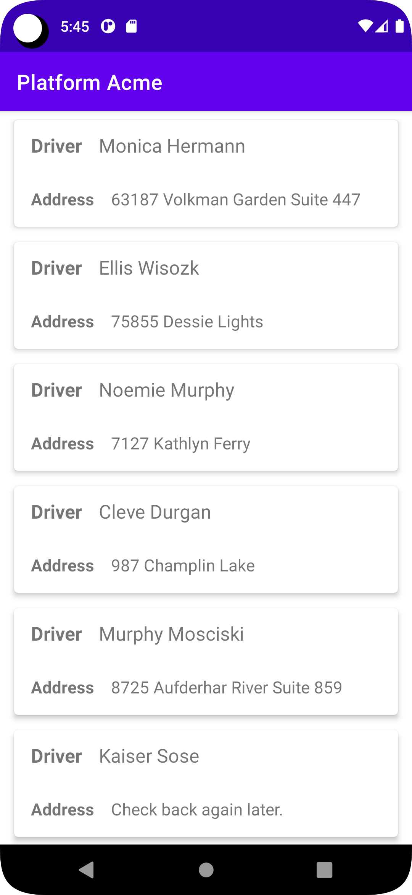

# Platform Acme
This App matches Shipments to Drivers based on a Top-Secret suitability score such that the global
score is maximized across all drivers (aka fleet). If there are more drivers than shipments, then
a message "Check back again later" is displayed to the drivers without shipments.
<p align="center">
    
</p>

## Matching Approach
This app is a demonstration of the assignment problem and is solved using the Hungarian Algorithm.
Since this algorithm minimizes cost by default, the suitability score was negated so that the
algorithm could maximize cost (i.e. suitability).

The app uses a 3rd party implementation of the Hungarian Algorithm which is hosted on [github](https://github.com/KevinStern/software-and-algorithms/blob/master/src/main/java/blogspot/software_and_algorithms/stern_library/optimization/HungarianAlgorithm.java) 
and referenced on [Wikipedia](https://en.wikipedia.org/wiki/Hungarian_algorithm#Implementations) 

## Build and Run
To build and run the project, clone this repo and run a gradle sync and clean. Ensure that your Java installation
is compatible with this project and that an emulator or device of at least SDK version 21 is available.
The 3rd party library is included in this app, so after the above gradle commands, the app should be ready to
build and deploy.

### Troubleshooting
You may need to specify the sdk in a `local.properties` file like so
```
sdk.dir=C\:\\Users\\[your-name-here]\\AppData\\Local\\Android\\Sdk
```

## Tests
Several unit tests were created to validate the code throughout this project. No instrumented tests were created
however only because of how small the UI / UX is.